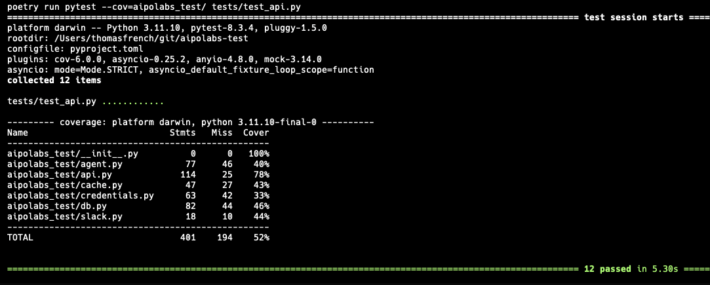

# AIpolabs Test

## Overview

Welcome to Thomas' AIpolabs engineering test!

This document explains the choice of tech stack, architecture, APIs, setup instructions, and provides an overview of the application's features.

For the exercise, I developed a service that provides a Slack App interface to a LangGraph-based agent that, once authenticated, can read, draft and send Gmail emails.

I added several features to bring it closer to a production service for reliability, security, and performance. More details below.

This was developed with the kind assistance of ChatGPT and Cursor.

---

## Tech Stack

For this test, I went with a simple tech stack; one that I know well, and is generally mature, robust, and easy to maintain.

The core stack is:

- **Python**: Core language for application development.
- **FastAPI**: For building high performance web APIs.
- **SQLAlchemy**: ORM for database interactions.
- **PostgreSQL**: Relational database for persistent data storage.
- **Redis**: Key-value datastore for caching event IDs and tokens.
- **LangGraph**: Framework for building the agent.
- **Slack API**: For integrating Slack App events as the external interface.
- **Google OAuth2**: Google authentication to access GmailAPIs.

For development, I used these tools:

- **Poetry**: For dependency management and virtual environment.
- **pytest**: For unit testing.
- **ruff**: For linting and code formatting.
- **Docker Compose**: For running the services.
- **Ngrok**: For creating a secure tunnel from Slack to the local API.

---

## Architecture

The application follows a standard service architecture that is (on the way to being) setup to be highly-available and scalable. At the core is a FastAPI server that handles the API requests from Slack and orchestrates the agent. We use PostgreSQL as the main persistent store and Redis as a cache. The agent state is checkpointed and stored in PostgreSQL (across restarts or workers). I used nginx as a load balancer and uvicorn as a production-ready server configured with two workers. For deployment, the services are containerised and run in Docker Compose.

- **Load Balancer**: Nginx to distribute traffic and improve reliability (although only a single API instance is running in the compose file).
- **FastAPI Server**: API server running with two replicas of uvicorn workers for handling API requests. Written using asynchronous code forhigh performance and throughput.
- **PostgreSQL Database**: Stores persistent data related to users tokens and agent sessions.
- **Redis Cache**: Caches event IDs and tokens to improve performance and reduce load on backend and database.
- **Slack App**: Configured to receive Slack events and send messages.
- **Google Web App**: Configured with OAuth permissions and scopes to authenticate users for Gmail APIs.

---

## APIs

The API handles events from Slack and Google OAuth2 authenticationcallbacks.

- **Slack Events (POST /slack/events)**: Handles incoming events from Slack. There are the following messages:
    - `hello`: provides a welcome message and instructions.
    - `auth`: initiates Google OAuth2 authentication.
    - `status`: checks the authentication status.
    - `chat`: allows the user to chat with the agent.
    - `revoke`: revokes the authentication credentials.
- **Google OAuth2 Callback (POST /auth/callback)**: Processes the authentication callback from Google to authorize access to Gmail.
    - Handles the callback from Google and completes the OAuth2 flow.

---

## Setup Instructions

1. **Setup Google Web App**:
   - Configure Google Web Application with Gmail scopes and specify the redirect URL.
   - Scopes: `https://www.googleapis.com/auth/gmail.readonly`, `https://www.googleapis.com/auth/gmail.send`, `https://www.googleapis.com/auth/gmail.compose`
   - Redirect URL: `http://localhost:8000/auth/callback` (or ngrok url)

2. **Set Environment Variables**:
   - Create `.env` and `.env.docker` files and set the required environment variables:
   - `SLACK_SIGNING_SECRET`: Slack signing secret.
   - `SLACK_BOT_TOKEN`: Slack bot token.
   - `GOOGLE_CLIENT_ID`: Google client ID.
   - `GOOGLE_CLIENT_SECRET`: Google client secret.
   - `GOOGLE_REDIRECT_URI`: Google redirect URI.
   - `OPENAI_API_KEY`: OpenAI API key.
   - `DB_HOST`: Postgres host.
   - `DB_NAME`: Postgres name.
   - `DB_USER`: Postgres user.
   - `DB_PASSWORD`: Postgres password.
   - `ENCRYPTION_KEY`: Database encryption key.
   - `REDIS_HOST`: Redis host.
   - `REDIS_PORT`: Redis port.

3. **Setup and launch Ngrok**:
   - Create an Ngrok account: https://ngrok.com/
   - Launch Ngrok: `make launch_ngrok`
   - Update Google application redirect URL with the Ngrok callback URL. For example: `https://<ngrok-id>.ngrok.app/auth/callback`
   - Update `GOOGLE_REDIRECT_URI` in `.env` and `.env.docker` with the Ngrok callback URL.
   - Update Slack bot events URL with the Ngrok callback URL.

4. **Generate an Encryption Key**:
   - Generate a secure encryption key for token encryption.
   - Update env variable `ENCRYPTION_KEY` in `.env` and `.env.docker`.

5. **Using Python 3.11**
    - Set Python version and install dependencies: `make setup`

---

## Development setup

### Running Tests (no infra required)

- Run the tests: `make run_tests`

A sample of tests are provided in `tests/test_api.py` - they are not extensive and could be improved (coverage ~50%).

In general, there's much to improve with testing, including more unit, integration and e2e tests. There are many moving pieces here that need thorough testing and evaluation.

### Running the Application

1. **Start the Databases**: `make start_infra`
    - This will start the PostgreSQL and Redis services using Docker Compose.

2. **Run Locally**: `make local_run`
    - Use the local Python environment to start the FastAPI server - good for quick development loops.

## Production setup

1. **Run all services with Docker Compose**: `make start`
   - Use Docker Compose to start the entire stack (FastAPI, PostgreSQL, Redis, Nginx).
   - View logs in the terminal.

2. **Stop all services**: `make stop`
---

## Overview of Features

### Authentication flow

- User trigger authentication flow with Slack (`auth` message)
- Slack sends an event to the API
- API validates the event
- API initiates the OAuth2 flow with Google
- Google redirects to the API with an authorization code
- API validates the authorization code
- API exchanges the authorization code for an access token
- API stores the access token
- API uses the token to access Gmail APIs
- API refreshes the access token when required

### Slack App interface

Provides a Slack App interface to the agent.

- Supports multiple messages:
  - **hello**: Responds with a greeting.
  - **status**: Checks the authentication status.
  - **auth**: Initiates Google OAuth2 authentication.
  - **chat**: Handles simple chat interactions.
  - **revoke**: Revokes previously granted OAuth2 permissions.

### Agent and Tools
- Implements an agent pattern to process Slack messages ("instructions") and take Gmail actions: read, draft, and send emails.
- Agents have persistent memory (PostgreSQL) and (authenticated) tools to take Gmail actions on behalf of the user.

### Persistence
- PostgreSQL is used to store user Google auth tokens securely using symmetric encryption.
- Agent memory sessions are checkpointed and stored in PostgreSQL to persist across restarts and workers. This includes using a simple distributed (Redis-based) lock to handle concurrent requests across workers (needs more testing!).

### Cache
- Utilizes Redis for caching tokens and event IDs to enhance API performance, reducing load on backend and database.
- Event IDs are cached for 1 hour (Slack can send duplicate events in a short period).
- User tokens are kept in cache for existence checks.
- Simple distributed lock to handle concurrent requests to the Agent

---

## Potential Improvements

There lots of potential improvements; here are some important ones to consider:

1. **Features**:
    - Improved agent UX, e.g. streaming responses; status updates; memory usage; context
    - Introduce Temporal for durable workflow orchestration.
    - Rate limiting/throttling to handle varying loads to the service
    - Queueing for handling concurrent requests & external service constraints
    - Add monitoring and observability to the infrastructure
    - Scale databases as required
    - Run databases in high-availability mode as required

2. **Improve/Refactor**
    - API structure
    - Logging
    - Tests: unit; integration; e2e
    - Other improvements, including code quality

2. **Dev improvements**
    - `alembic` for database migrations
    - Github actions for CI/CD
    - `uv` for dependency management
    - `devcontainers` for development environment
---

Thank you for reviewing my submission. It's been fun.
